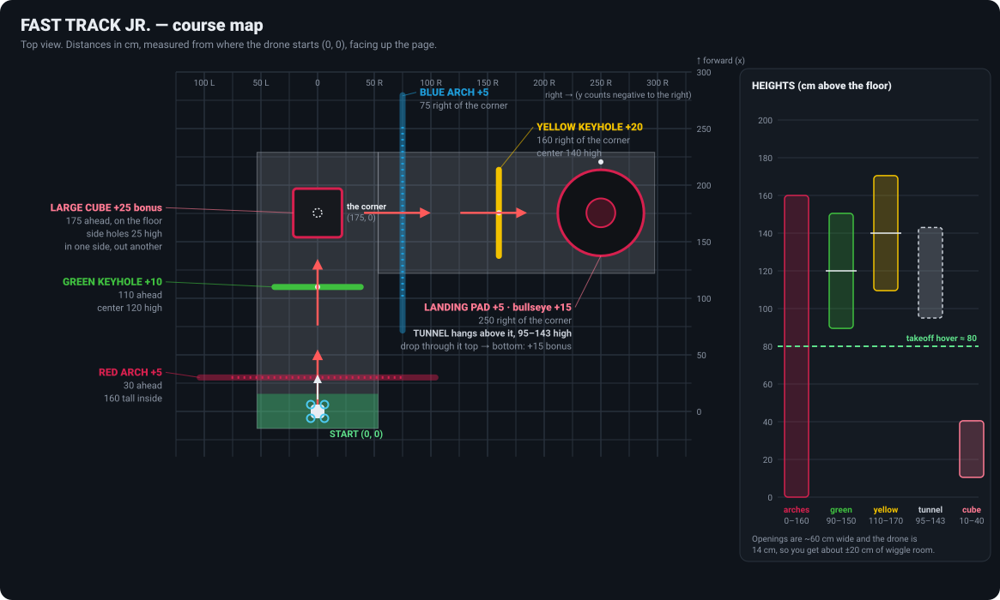

# 🚁 Fast Track Jr. — autonomous drone coding workshop

Welcome to the aerial drone club! In this workshop you write a **Python program that flies a CoDrone EDU
through an obstacle course by itself**. Nobody touches the controller. Your code *is* the pilot.

The course is a mini version of the real **ADC Mission 2027: Fast Track** autonomous flight field we compete
on this season. You write and test your code in the **[Mission Lab](https://theactualjacob.github.io/fast-track-jr/)**
(in your browser), then submit it, and every flight gets replayed in 3D on the big screen, all racing each other.
⏱️ You have about **20 minutes**.



📄 **Printable handout:** [Fast-Track-Jr-Mission-Guide.pdf](docs/Fast-Track-Jr-Mission-Guide.pdf) (course map, measurements,
code cheat sheet, how to submit).

---

## Your mission

Take off, get through as many gates as you can, and land. Tasks can be done in any order, but you have to fly
through each gate **in the direction of its arrow**.

| Task | Where (from the start) | Points |
|---|---|---:|
| Take off | — | 5 |
| 🔴 Fly **under** the red arch | 30 cm ahead | 5 |
| 🟢 Fly **through** the green keyhole | 110 cm ahead · ring center **120 cm** high | 10 |
| 🔵 Fly **under** the blue arch | around the corner: **75 cm right** of the corner | 5 |
| 🟡 Fly **through** the yellow keyhole | **160 cm right** of the corner · ring center **140 cm** high | 20 |
| 🛬 Land on the landing pad | **250 cm right** of the corner | 5 |
| 🎯 …or land on the **bullseye** (center ring) instead | same | 15 |
| ⭐ **Bonus:** fly through the large cube | on the floor at the corner (175 cm ahead). Side holes are 25 cm high. In one side, out another. | 25 |
| ⭐ **Bonus:** drop through the tunnel | hangs over the landing pad, 95–143 cm high. Fly over it, then go straight down through it. | 15 |
| ⭐ Land on top of the cube (instead of the pad) | | 10 |

- **The corner** is 175 cm straight ahead of the start. That's where the course turns **right**.
- After `takeoff()` the drone hovers at about **80 cm**.
- Each gate can score up to **2 times**. The landing only counts once, at the very end.
- The match is **3 minutes**. Anything after 3:00 doesn't count.
- 💥 If the drone hits anything, it crashes and your run is over. Points you already earned still count.
- Ties are broken by time: faster wins.

## 🚀 Start here: the Mission Lab

### **→ https://theactualjacob.github.io/fast-track-jr/**

Everything happens in your browser. There's nothing to install, and it works on a Chromebook.

1. Type your **GitHub username** in the top bar. No account? Just type your name.
2. Write your code where the `TODO`s are. Use the map above and the [cheat sheet](docs/cheatsheet.md).
3. Press **Fly** (or Ctrl/⌘ + Enter). Your drone flies the course in 3D next to your code, and the line that's running
   lights up. Crashes and bugs point to the exact line. Fly as often as you like; your code is saved automatically.
   Drag the divider to give the code or the replay more room, or collapse either side.
4. When you're happy, click **Submit**:
   - **Open a pull request** if you have a GitHub account. GitHub opens with your file already filled in: click
     **Commit changes → Propose changes → Create pull request**.
   - **Copy share link** if you don't. It packs your code into a link; paste it wherever your leader asks.

When time's up, we replay everyone's flight on the projector, all racing at once. 🏁

<details>
<summary>Submitting without the Lab (GitHub website only)</summary>

1. Open this repo's **`missions`** folder, open **`_template.py`** and copy its code.
2. Go back to `missions`, click **Add file → Create new file**, name it **`your-github-username.py`** and paste.
3. Click **Commit changes… → Propose changes → Create pull request**.
4. A check at the bottom of your PR flies your code: ✅ it ran (click **Details → Summary** for your score) or ❌ it
   has a bug (click **Details** to see the line). To fix it, open **Files changed → ⋯ → Edit file** in your PR.
</details>

## The five commands you'll use most

```python
drone.takeoff()             # up to ~80 cm
drone.move_forward(110)     # cm; also move_backward / move_left / move_right
drone.move_upward(40)       # also move_downward
drone.turn_right(90)        # also turn_left
drone.land()
```

Everything else is in the **[cheat sheet](docs/cheatsheet.md)**.

## Hints (open only if you're stuck)

<details>
<summary>Hint 1: the green keyhole</summary>

After takeoff you're at 80 cm, but the keyhole's center is at 120 cm. If you fly forward at 80 cm you'll smash
into the bottom of the ring. Climb **40 cm** first.
</details>

<details>
<summary>Hint 2: going around the corner</summary>

There are two ways:

- `drone.turn_right(90)` and then `move_forward(...)`. Turns can overshoot by a couple of degrees, which adds up
  over 2.5 m.
- Don't turn at all: `drone.move_right(...)` flies sideways. It's more accurate!
</details>

<details>
<summary>Hint 3: the tunnel over the landing pad</summary>

Fly at 140 cm toward the pad and you'll hit the side of the tunnel. Either:

- **go under it:** get below ~85 cm before you reach it, then land. Safe.
- **go over it:** climb above ~150 cm, stop right over the pad, then `land()`. You drop through the tunnel
  for **+15** bonus. If you're centred, you also get the bullseye.
</details>

<details>
<summary>Hint 4: the cube bonus (hard!)</summary>

The side holes are 30 cm wide and centred 25 cm off the floor, and the drone is 14 cm wide. So you have
about ±8 cm to play with. Get low **before** you reach the cube. Fly into the middle of it, then leave through
a *different* side, e.g. slide out to the right.
</details>

## How this compares to the real competition

The real **Mission 2027: Fast Track** autonomous mission uses the same kinds of field elements (arches, keyholes,
a large cube, a tunnel, a landing pad with a bullseye), the same sizes and the same 3-minute match. The real
field also has a **spiral** of three mini keyholes, and it's laid out differently. Point values here match the
real game where the task exists.

The simulator models the real drone's timing and gets the details right, like turns overshooting and sensors
going out of range. The real drone still drifts a little, and every drone is different. Code that works here is a
great start, but you'll always tune it on the real mat.

---

<details>
<summary>🛠️ Optional: run the simulator on your own computer</summary>

You need Python 3.9 or newer, and nothing else to install.

```bash
git clone <this repo's URL>
cd <repo folder>
python fly.py missions/your-github-username.py            # fly + open the 3D replay
python fly.py missions/your-github-username.py --watch    # re-fly every time you save
python fly.py --course                                    # look around the course
```

To fly the **real** drone instead: `pip install codrone-edu`, plug in the controller, and run
`python missions/your-github-username.py`.
</details>
